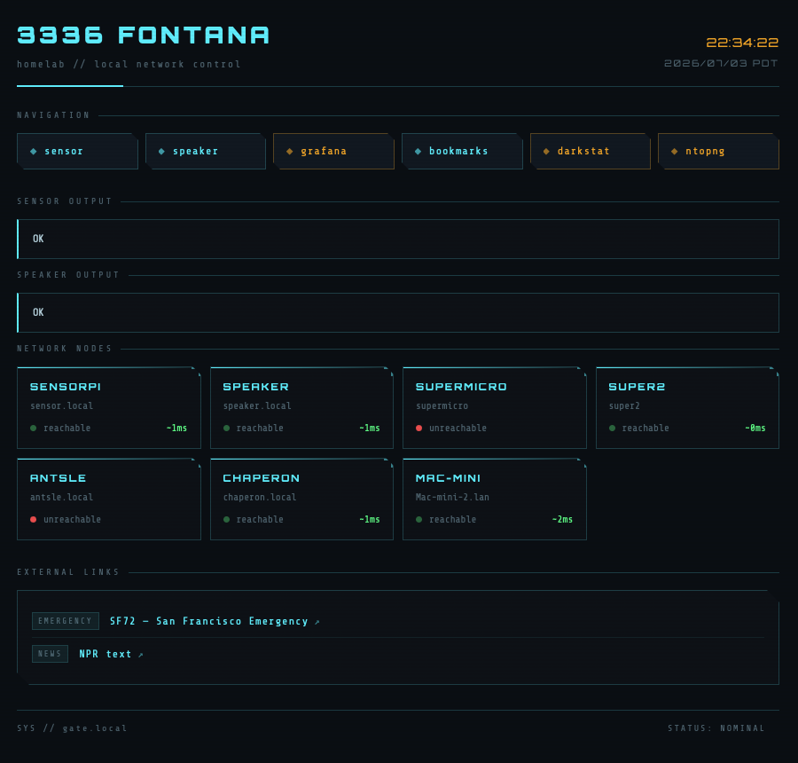
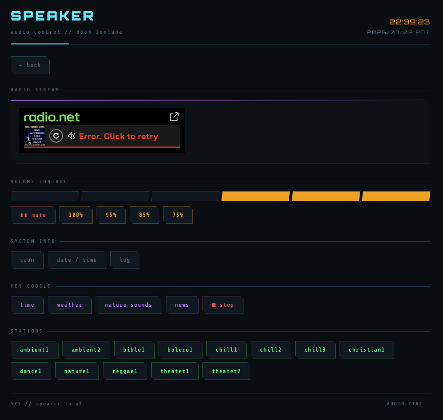
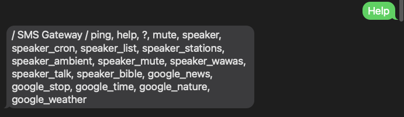
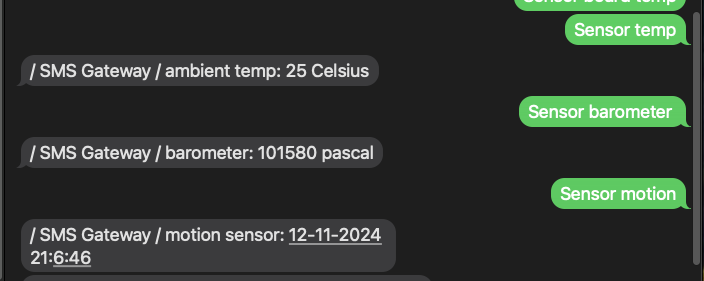

# gate-pi

Home lab gateway services running on a Raspberry Pi. **gate-pi** is the front door to a small fleet of Pis (speaker-pi, sensor-pi, monitoring nodes), exposing them through three independent interfaces:

| Component | Interface | Runtime |
|---|---|---|
| [`web_gate/`](web_gate/) | Web dashboard (PHP + nginx) | nginx + systemd tunnel service |
| [`telegram-bot/`](telegram-bot/) | Telegram bot | systemd service |
| [`sms_gate/`](sms_gate/) | SMS via email-to-SMS gateway | cron |

All three talk to the same backend REST APIs served by the other Pis on the LAN (see [Speaker-pi](https://github.com/mayelespino/Speaker-pi) and [Sensor-pi](https://github.com/mayelespino/Sensor-pi)).

## Architecture

```
                    Internet
                       │
        ┌──────────────┼──────────────────┐
        │              │                  │
   Pinggy tunnel   Telegram API      Email/SMS provider
 (mayelespino.com)     │                  │
        │              │                  │
        ▼              ▼                  ▼
  ┌─────────────────────────────────────────────┐
  │                  gate-pi                    │
  │  nginx + PHP    telegram-bot.py  sms_gate.py│
  │  (web_gate)     (systemd)        (cron)     │
  └─────────┬──────────────┬──────────────┬─────┘
            │         REST over LAN       │
            ▼              ▼              ▼
      speaker-pi:5000  sensor-pi:5000  darkstat / ntopng
```

## Web Gateway (`web_gate/`)

A cyberpunk-styled PHP dashboard served by nginx, reachable two ways:

- **From the LAN:** `http://gate.local` — all links enabled, including the speaker controls.
- **From the internet:** [http://mayelespino.com/home](http://mayelespino.com/home) via a [Pinggy](https://pinggy.io) SSH tunnel — the speaker link is **disabled** outside the local network.



The "OK" badges next to Speaker and Monitor indicate the corresponding Pi and its service are up. The dashboard links out to:

- **speaker.php** — controls speaker-pi (radio stations, volume, mute, and "Hey Google" commands played through the speaker to a nearby Google Home).
- **sensor.php** — reads sensor-pi (temperature, humidity, brightness, barometer, motion, speed test).
- **bookmarks.php** — a small bookmark manager backed by storage mounted at `/mnt/bookmarks`.
- **darkstat / ntopng** — network monitoring services running elsewhere in the lab.

When on the LAN, the speaker page looks like this:



### Installation

1. Install nginx + PHP and copy the contents of `web_gate/` to `/var/www/html/`.
2. Install `web-gate-startup.service` to `/etc/systemd/system/` and `start.sh` to `/home/pi/bin/`. This keeps the Pinggy tunnel up in a retry loop:
```sh
   sudo systemctl daemon-reload
   sudo systemctl enable --now web-gate-startup
```
3. Install the crontab entries from `web_gate/crontab.txt` (mounts the bookmarks USB drive at boot).
4. Health monitoring: `check-sensor-health.py` and `email_if_outage.py` run from cron and email an alert (via `send_email.py`) if a backend node stops responding.

Details: [web_gate/readme.md](web_gate/readme.md)

## Telegram Bot (`telegram-bot/`)

A long-polling Telegram bot (no webhooks, so no inbound ports needed) that dispatches commands to speaker-pi. Restricted to a single `chat_id`, so only the configured account can drive it.

| Command | Action |
|---|---|
| `/help` | List available commands |
| `/ping` | Liveness check (`PONG@chap`) |
| `/stations` | List available radio stations |
| `/play <station>` | Play a station |
| `/volume <0-100>` | Set volume |
| `/stop` | "Hey Google, stop" |
| `/time` `/weather` `/news` `/nature_sounds` | "Hey Google" voice commands |
| `/echo <text>` | Echo back (sanity test) |

### Installation

1. Copy `telegram-bot/` to `/home/pi/telegram-bot/`.
2. Create `telegram-bot.ini` with your bot token (from [@BotFather](https://t.me/BotFather)) and your chat id:
```ini
   [telegram]
   token = YOUR_BOT_TOKEN
   chat_id = YOUR_CHAT_ID
```
3. Install and start the service:
```sh
   sudo cp telegram-bot.service /etc/systemd/system/
   sudo systemctl daemon-reload
   sudo systemctl enable --now telegram-bot
   sudo systemctl status telegram-bot
```

The service restarts automatically on failure (`Restart=always`, `RestartSec=5`).

## SMS Gateway (`sms_gate/`)

Control the home lab by text message, with no app required. It works over a carrier's email-to-SMS bridge:

1. A text sent to the gateway number arrives as an email in a dedicated inbox.
2. `sms_gate.py` (run every minute by cron, looping 5× with 10 s sleeps for ~10 s polling granularity) reads the inbox over IMAP.
3. The message body is normalized (`sensor temp` → `sensor_temp`) and looked up in a command dictionary.
4. The matching REST call is made to speaker-pi or sensor-pi, and the result is emailed back — which the provider delivers as an SMS reply.

Send `help` to get the full command list:



`ping` for a liveness check:


Query sensors:



Or drive the Google Home assistant through the speaker:


Supported commands include: `ping`, `help`, `mute`, `speaker_list`, `speaker_ambient`, `speaker_wawas`, `speaker_talk`, `speaker_bible`, `google_news`, `google_weather`, `google_time`, `google_stop`, `google_nature`, `sensor_temp`, `sensor_humidity`, `sensor_brightness`, `sensor_barometer`, `sensor_motion`, `sensor_board_temp`, `sensor_all`, and `speedtest`.

### Installation

1. Copy `sms_gate/` to `/home/pi/sms_gate/`.
2. Fill in `sms_gate.cfg` with the gateway email account (IMAP/SMTP servers and credentials), the destination SMS email address, and the speaker-pi / sensor-pi base URLs. **Keep the real config out of git** — the checked-in file is an empty template.
3. Install the crontab from `sms_gate/crontab.txt`: runs the gateway every minute, sends a restart notification at boot (`sms_send.py`), and cleans the mailbox weekly.

Details: [sms_gate/readme.md](sms_gate/readme.md)

## Configuration & Secrets

None of the config files in this repo contain real credentials:

- `sms_gate/sms_gate.cfg` — empty template; the live copy with real values lives only on the Pi.
- `telegram-bot/telegram-bot.ini` — placeholder values; real token/chat id live only on the Pi.

## Related Projects

- [Speaker-pi](https://github.com/mayelespino/Speaker-pi) — internet radio + text-to-speech REST service
- [Sensor-pi](https://github.com/mayelespino/Sensor-pi) — environmental sensor REST service
- [Chaperon](https://github.com/mayelespino/Chaperon) — safety check-in Telegram bot
- [MyLUtils](https://github.com/mayelespino/MyLUtils) — misc utilities

## License

[GPL-3.0](LICENSE)
